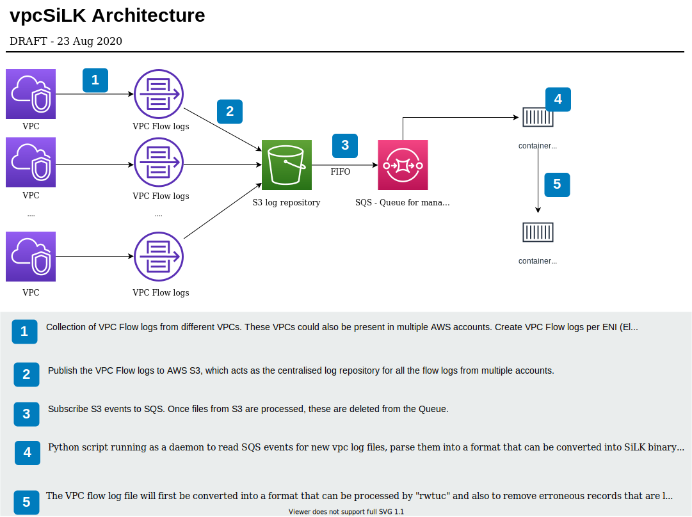

# Processing VPC Flow Logs with SiLK (vpcSiLK)

## Overview 
SiLK (System for Internet-Level Knowledge), is a collection of traffic analysis tools that facilitates the efficient collection, storage and analysis of network flow data. The SiLK packing system works with native flow data such as IPFIX flows from yaf, NetFlow v5 or v9 PDUs from a router. 

SiLK is very useful for security analysts as it provides analysts the ability to querly large volumes of historical flow data sets. However, SiLK does not have an in-built mechanism to directly process logs from cloud service providers such as AWS and with an increase in the use of cloud infrastucture, this is a potential gap. 

One of the challenges associated with AWS VPC (Virtual Private Cloud) Flow logs is the volume of these logs, and SiLK can help address this challenge effectively as the SiLK binary files are significantly smaller in size (QN:: how much smaller, add some stats) and can be queried more efficiently (QN:: add some stats on query times based on data volume). 

vSiLK is an application that processes AWS VPC Flow Logs and makes the data available to security analysts. 

## VPC Flow Logs
VPC Flow logs captures IP traffic traversing through network interfaces in a VPC. VPC flow logs can be published to either CloudWatch or S3. vSiLK assumes that the VPC Flow logs are available in an S3 bucket, as the data needs to be parsed prior to consumption by SiLK.  

## Data Mapping 
The `rwtuc` tool from the SiLK tool set is used for converting VPC Flow logs in ASCII format to SiLK binary files. In order for the `rwtuc` tool to be used, the VPC Flow records need to be parsed and be mapped to pre-existing SiLK fields. 

A detailed description of all the flow logs records from the VPC Flow logs is available here - https://docs.aws.amazon.com/vpc/latest/userguide/flow-logs.html. 

| VPC Field  | Version | SiLK Field |
|---|---|---|
| version | 2 | N/A |
| account-id | 2 | N/A - potential new field to be added to SiLK |
| interface-id | 2 | sensor, 12 | 
| srcaddr | 2 | sIP, 1 | 
| dstaddr | 2 | dIP, 2 | 
| srcport | 2 | sPort, 3 | 
| dstport | 2 | dPort, 4 | 
| protocol | 2 | protocol, 5 | 
| packets | 2 | packets, 6 | 
| bytes | 2 | bytes, 7 | 
| start | 2 | sTime, 9 | 
| end | 2 | eTime, 10 | 
| action | 2 | N/A - potential new field to be added to SiLK |
| log-status | 2 | N/A - erroneous records will be removed prior to SiLK processing | 
| vpc-id | 3 | N/A - potential new field to be added to SiLK |
| subnet-id | 3 | N/A - potential new field to be added to SiLK |
| instance-id | 3 | N/A - potential new field to be added to SiLK | 
| tcp-flags | 3 | flags, 8 | 
| type | 3 | N/A | 
| pkt-srcaddr | 3 | N/A - potential new field to be added to SiLK | 
| pkt-dstaddr | 3 | N/A - potential new field to be added to SiLK | 
| region | 4 | scc, 18 | 
| az-id | 4 | N/A | 
| sublocation-type | 4 | N/A | 
| sublocation-id | 4 | N/A | 

## Architecture and set-up

## Use-cases 
Display information about a specific SiLK file
`rwfileinfo vpc.rw`

Output the top 10 records from the SiLK file
`rwfilter --data-rootdir=/opt/silkrw --site-config-file=/var/silk/data/silk.conf --pass=stdout | rwcut --num-recs=10` 

Filter for events where one port is 80 and the other is ephemeral. 
`rwfilter --data-rootdir=/opt/silkrw --site-config-file=/var/silk/data/silk.conf --aport=80 --all=stdout --start-date=2020/08/12 --end-date=2020/08/13| rwfilter --input-pipe=stdin --aport=1024-65535 | rwcut `

Split traffic into 30 minutes (1800 secs) bins
`rwfilter --data-rootdir=/opt/silkrw --site-config-file=/var/silk/data/silk.conf --all=stdout | rwcount --bin-size=1800`

Output the number of records that match a specific filter 
`rwfilter --data-rootdir=/opt/silkrw --site-config-file=/var/silk/data/silk.conf --all=stdout | rwuniq --field=sip,proto --bytes --packets`

## References
* SiLK - https://tools.netsa.cert.org/silk/
* yet another flow collection (yaf) - https://tools.netsa.cert.org/yaf/index.html 
* Overview of VPC Flow logs - https://docs.aws.amazon.com/vpc/latest/userguide/flow-logs.html
* FlowBAT - https://github.com/chrissanders/FlowBAT
* FlowPlotter - https://github.com/automayt/FlowPlotter
* Network Security Through Data Analysis: From Data to Action - https://www.amazon.com/Network-Security-Through-Data-Analysis/dp/1491962844